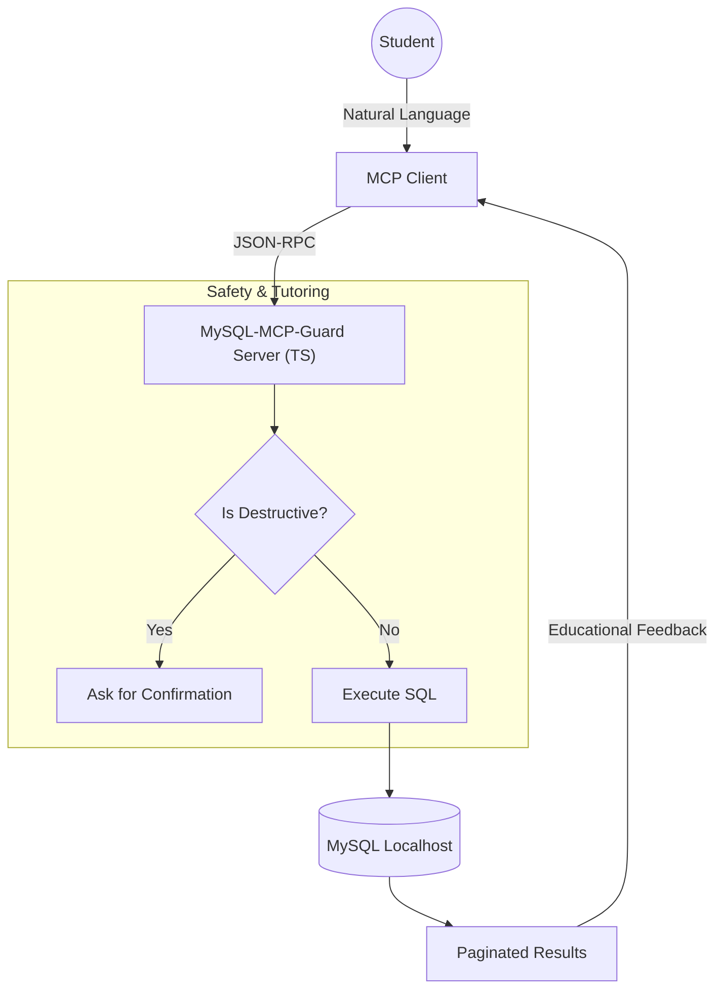

# MySQL-MCP-Guard (Global Tutor Edition)

[](https://opensource.org/licenses/MIT)
[](https://www.typescriptlang.org/)
[](https://modelcontextprotocol.io)

> **MySQL-MCP-Guard** is more than just a database connector; it's the tutor you wish you had in your first year of university. Transform your AI into a SQL expert that guides, protects, and teaches you.

---

## Why UniMySQL?

Unlike other MCP servers that are "black boxes" or security risks, UniMySQL is built on the philosophy of **Supervised Learning**:

### 1. Interactive Supervision Layer
If you attempt a `DELETE` or `UPDATE`, the server intercepts the request. The Tutor explains the consequences and only executes the command if you explicitly confirm. No more accidental data loss!

### 2. Educational Planner (Explain-First)
Built-in audit tools analyze how MySQL executes your queries. The AI can detect missing indexes or inefficient queries before they become a problem.

### 3. Relationship Mapping (Oracle Style)
We automatically detect Foreign Keys (FK) and present them clearly so the LLM understands your schema without hallucinations.

### 4. Bulk Data Export (CSV/JSON)
Export thousands of rows directly to your local `exports/` folder without hitting chat limits.

### 5. Native Schema Resources
Expose your full database schema as an MCP Resource (`mysql://localhost/schema`), allowing the AI to understand your tables instantly without executing tools.

### 6. Interactive Prompts
Use built-in teaching templates like `sql_lesson` and `schema_audit` to guide your learning journey.

---

## How it Works (Architecture)



---

## Quick Start (Recommended)

You don't even need to clone this repository! Just run it directly using `npx`:

```json
// Add this to your Claude Desktop config or Cursor MCP settings
"mcpServers": {
  "mysql-mcp-guard": {
    "command": "npx",
    "args": ["-y", "mysql-mcp-guard"],
    "env": {
      "MYSQL_HOST": "localhost",
      "MYSQL_USER": "your_user",
      "MYSQL_PASSWORD": "your_password",
      "MYSQL_DATABASE": "your_database"
    }
  }
}
```

---

## Technical Specifications

### Environment Variables
| Variable | Description | Default |
| :--- | :--- | :--- |
| `MYSQL_HOST` | Database host (Use `host.docker.internal` if MySQL is in Docker) | `localhost` |
| `MYSQL_USER` | Database user | `root` |
| `MYSQL_PASSWORD`| Database password | (empty) |
| `MYSQL_DATABASE`| Database name | `test` |

### Available Tools
- `list_tables`: List all database tables.
- `describe_table`: Detailed schema and relations mapping.
- `execute_query`: SQL execution with safety confirmation for UPDATE/DELETE.
- `explain_query`: Performance analysis and indexing advice.
- `export_data`: Stream large results to CSV/JSON files.

### MCP Resources & Prompts
- **Resource:** `mysql://localhost/schema` - Instant access to full schema context.
- **Prompt:** `sql_lesson` - Personalized SQL tutorials using your data.
- **Prompt:** `schema_audit` - Expert analysis of your database design.

---

## Agent Configuration

### Claude Desktop
Add this to your `claude_desktop_config.json`:
```json
"unimysql-ts": {
 "command": "node",
 "args": ["/absolute/path/to/unimysql-mcp-ts/dist/index.js"]
}
```

### Cursor / Gemini CLI
Point the MCP server to the `dist/index.js` file path.

---

## The "Tutor User" (Best Practices)
Don't use `root`. Be a good engineer and create a user with just enough permissions:

```sql
CREATE USER 'mcp_tutor'@'localhost' IDENTIFIED BY 'your_password';
GRANT SELECT, INSERT, UPDATE, DELETE ON university.* TO 'mcp_tutor'@'localhost';
FLUSH PRIVILEGES;
```

---

## Contributing
This is an **Open Source** project for students. If you have an idea for a new educational tool, open a PR!

*Made with  for the OpenAI community and students worldwide.* 
ucational tool, open a PR!

*Made with  for the OpenAI community and students worldwide.* 
